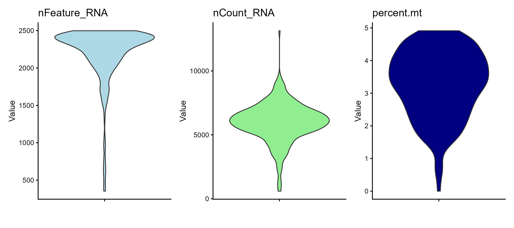
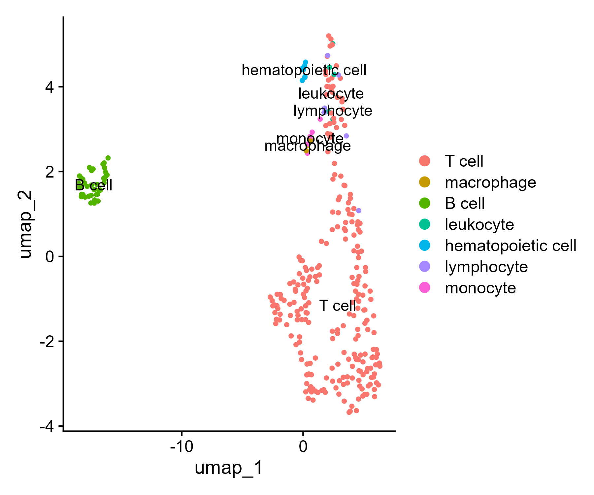
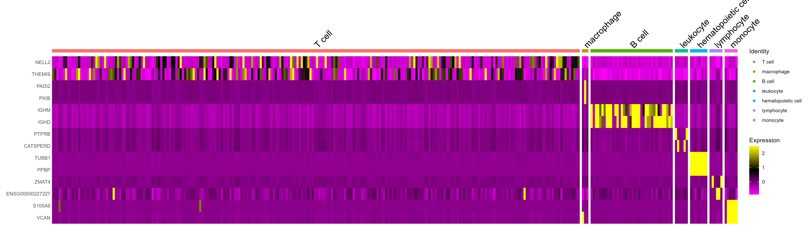
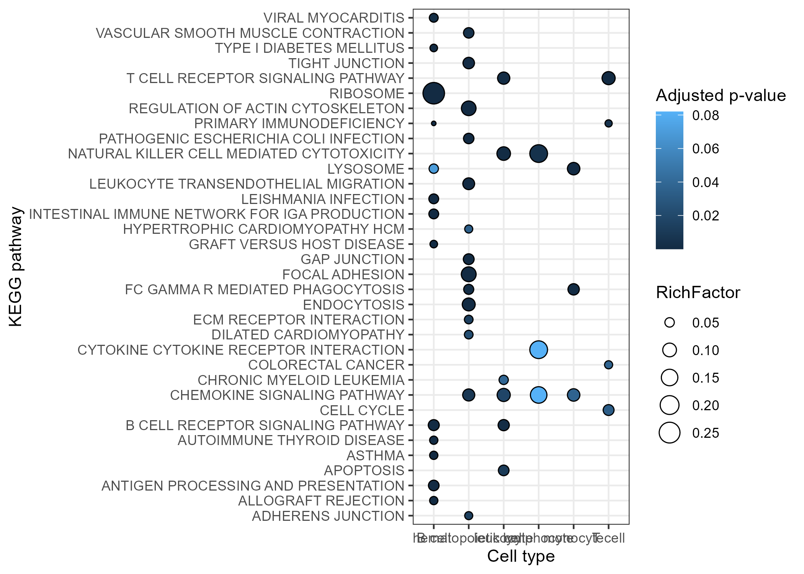
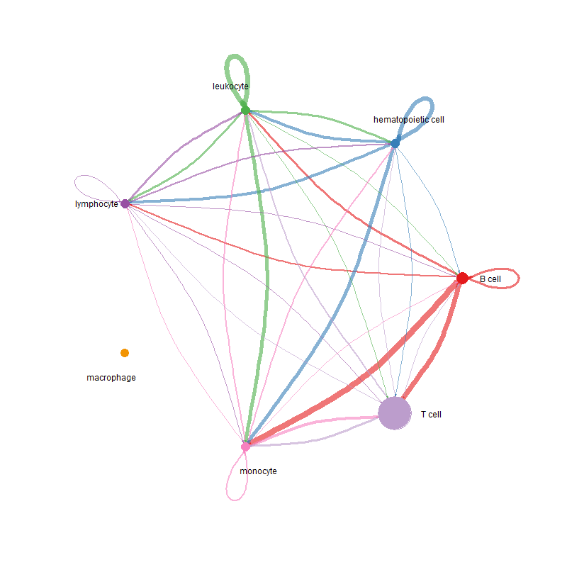
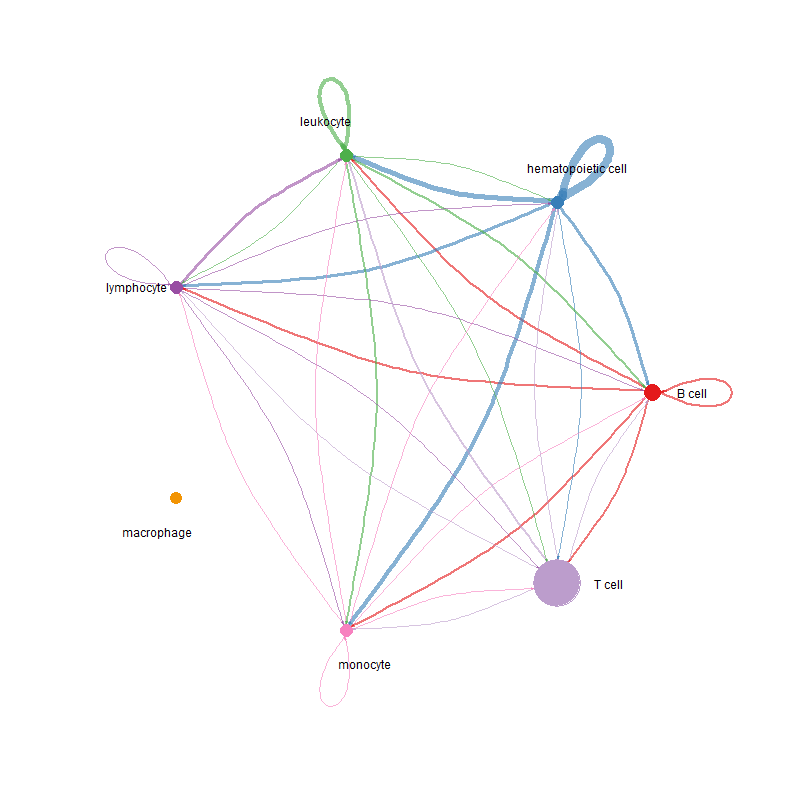
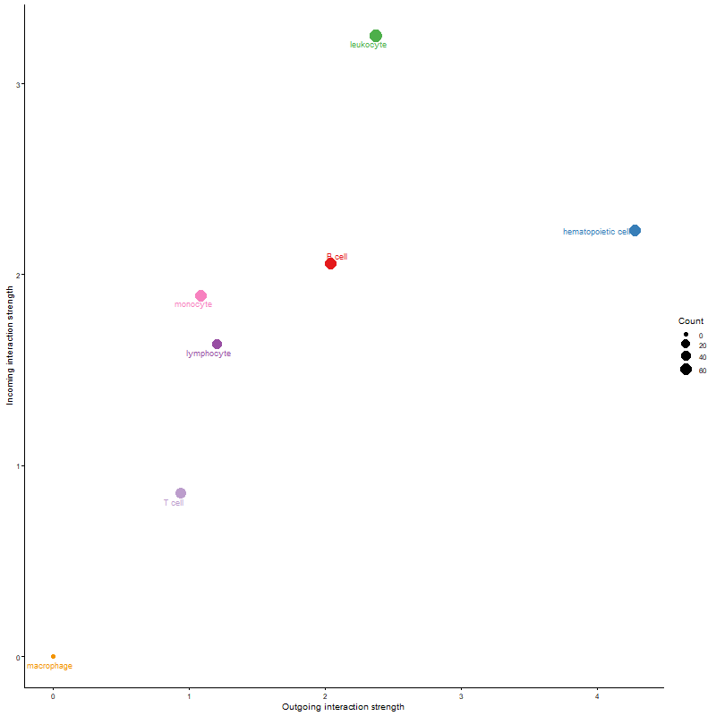

# scRNA-seq-Analysis-Using-Seurat-and-CellChat

## Project Overview
This project implements a complete single-cell RNA sequencing (scRNA-seq) analysis workflow in R, from raw count data to biological interpretation. The pipeline integrates data preprocessing, clustering, cell type annotation, functional enrichment analysis, and cell–cell communication inference, providing a multi-layered understanding of cellular heterogeneity and intercellular signaling.

## Project Aim 
To identify transcriptionally distinct cell populations, characterize their biological functions, and infer potential communication networks between cell types using scRNA-seq data.

## Analysis Workflow
The analysis follows a standard and reproducible scRNA-seq pipeline:

**Data loading**

⬇️

**Quality control**

⬇️

**Cell filtering**

⬇️

**Normalization**

⬇️

**Identification of highly variable genes**

⬇️

**Scaling**

⬇️

**Dimensionality reduction (PCA)**

⬇️

**Clustering**

⬇️

**UMAP visualization**

⬇️

**Marker gene identification**

⬇️

**Cell type annotation**

⬇️

**Pathway enrichment analysis (KEGG & ORA)**

⬇️

**Cell–cell communication analysis (CellChat)**

## Data Description
**Input:** The input data consists of a gene expression count matrix stored in an HDF5 file using the 10X Genomics format, loaded in R using `Read10X_h5()`.

The resulting object (`sc_counts`) is a matrix where:

- rows represent genes
- columns represent individual cells
- each value represents the number of detected UMIs for a given gene in a given cell

**Additional metadata:** Precomputed cell type annotation table, which is later integrated into the Seurat object for biological interpretation.

## Tools and Packages Used
- Seurat
- ggplot2
- dplyr
- msigdbr
- clusterProfiler
- CellChat

## Key Analysis Steps

**1. Quality Control**
Cells were evaluated based on:
- `nFeature_RNA` (number of detected genes)
- `nCount_RNA` (total counts per cell)
- `percent.mt` (mitochondrial gene expression)

Low-quality cells, doublets, and stressed cells were removed using threshold-based filtering.

#### QC Violin Plot

QC metrics indicate overall good-quality cells with controlled mitochondrial content.

**2. Normalization and Feature Selection**

Raw counts were normalized using log-normalization to correct for differences in sequencing depth across cells, enabling meaningful comparison of gene expression levels. 

Highly variable genes were then identified, which capture the most informative biological variability and drive downstream dimensionality reduction and clustering.

**3. Dimensionality Reduction and Clustering**

Principal Component Analysis was applied to reduce the dimensionality of the dataset by summarizing gene expression into major axes of variation.

Based on the selected principal components, a shared nearest neighbor graph was constructed, and cells were clustered according to transcriptional similarity.

UMAP was used to visualize the resulting clusters in a low-dimensional space.

#### UMAP Clustering

Cells separate into distinct clusters, indicating clear transcriptional heterogeneity within the dataset.

**4. Marker Gene Identification**

Cluster-specific marker genes were identified using the Wilcoxon rank-sum test, comparing gene expression between each cluster and all other cells.These markers represent genes that are significantly enriched in specific clusters and define the molecular identity of each cell population.

#### Marker Gene Heatmap

Cluster-specific marker genes show distinct expression patterns, supporting the molecular identity of each cell population.

**5. Cell Type Annotation**

Clusters were annotated by matching cell barcodes with an external cell type annotation table, assigning biological meaning to transcriptionally defined clusters and enables interpretation of cellular composition within the dataset.

**6. Pathway Enrichment Analysis**

Over-representation analysis (ORA) was performed on marker genes associated with each cell type using KEGG pathway gene sets, which identified biological pathways that were significantly enriched within specific cell populations, providing functional insight into their roles.

#### Pathway Enrichment (ORA)

Enriched KEGG pathways highlight functional differences and biological processes associated with each cell type.

**7. Cell–Cell Communication Analysis**

CellChat was used to infer potential ligand–receptor interactions between cell types based on their gene expression profiles, which enables the characterization of intercellular communication networks, including the identification of signaling sources (sender cells), signaling targets (receiver cells), and the relative strength and number of inferred interactions.

#### Cell–Cell Communication (Number of Interactions)

The network shows the number of inferred ligand–receptor interactions between cell types, indicating overall communication activity.

#### Cell–Cell Communication (Interaction Strength)

Interaction strength reflects the intensity of signaling between cell types, suggesting dominant communication pathways.

#### Sender vs Receiver Roles

Cell types are positioned based on their signaling roles, distinguishing major signal senders from receivers in the network.

